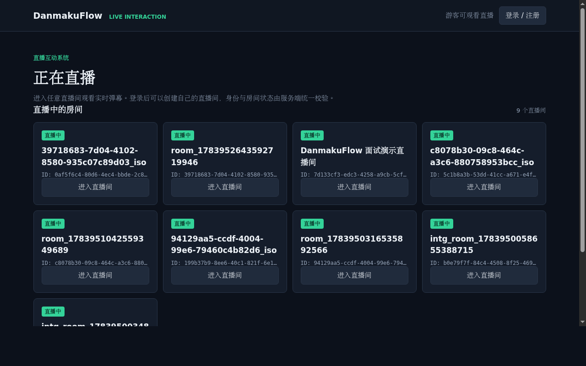
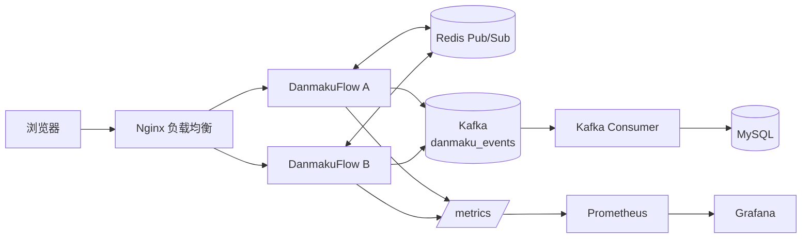

# DanmakuFlow：面向直播互动的分布式实时系统

一个可操作的直播互动系统：观众可匿名观看，登录后发送弹幕；房主创建、开播和结束直播；Nginx 将请求分发到双实例，Redis 完成跨实例实时广播，MySQL 保存可回放的历史弹幕。





**三项可验证成果**

- **业务闭环**：JWT 身份、直播间 `pending -> live -> ended` 状态机、匿名观看和历史回放都可在浏览器直接操作。
- **双实例实时性**：Docker Compose 启动 Nginx、两个应用实例、Redis 和 MySQL；集成测试验证跨实例弹幕投递与房间隔离。
- **工程可观测**：`/healthz`、`/readyz`、Prometheus 指标、Grafana 面板和可选 pprof 支撑故障定位与压测分析。

## 90 秒演示

```bash
docker compose up --build -d
go run scripts/demo_setup.go
```

1. 用脚本输出的主播账号登录大厅，创建直播间后点击“开始直播”。
2. 在第二个浏览器窗口用观众账号打开同一房间，两个窗口会实时收到同一条弹幕。
3. 主播点击“结束直播”，两个窗口立即禁用发送区，但历史弹幕仍可查看。
4. 打开 Grafana `http://localhost:3000`，展示连接数、发送量和广播延迟等指标。

脚本默认面向本地 Docker 演示环境；它会注册或登录两组演示账号、创建一间新房并开播，随后打印可以直接打开的房间 URL。

## 系统架构

### 单实例架构

```
┌──────────────┐      ┌──────────────────────────────────────┐
│  浏览器/客户端  │ ──WS→ │  WebSocket 升级 (handler.go)          │
│  (WebSocket)  │ ←广播─ │    ↓                                │
└──────────────┘      │  Client (readPump / writePump)        │
                      │    ↓                                │
                      │  Room (独立 goroutine + client 池)     │
                      │    ↕                                │
                      │  Hub (房间管理器 + 跨实例广播)           │
                      └──────────┬───────────────────────────┘
                                 │
                    ┌────────────┼────────────┐
                    ▼            ▼            ▼
           Service 层      Redis Pub/Sub   Kafka Producer
           create/validate (实时跨实例广播) (at-least-once 持久化)
           频率限制 + 广播   非阻塞有界队列   同步 produce(acks=all)
                    │                         │
         ┌──────────┴──────────┐              │
         ▼                     ▼              ▼
  MySQL (异步 channel)    MemoryStore    Kafka Consumer
  GORM 逐条写入           (开发/测试)    (幂等写入 MySQL)
```

### 双实例部署架构

```
                   ┌───────┐
   客户端 ──WS──→ │ Nginx │ ← 统一入口 localhost:8080
                   │ 负载均衡 │
                   └───┬───┘
              ┌────────┴────────┐
              ▼                 ▼
       danmaku-a:8081    danmaku-b:8082
       (instance ID A)  (instance ID B)
              │                 │
              └──────┬──────────┘
                     ▼
               Redis Pub/Sub
              (跨实例广播)
                     │
                     ▼
                 MySQL 8.0
              (持久化存储)
```

Prometheus 抓取两个实例的 `/metrics`，Grafana 提供统一监控面板。

## 功能特性

### 核心功能
- **用户认证系统** — 注册/登录/JWT 签发，Password bcrypt 哈希，nickname 长度限制，统一 Actor 认证模型
- **直播间管理** — 创建/查询/开始/结束直播，房间状态机（pending → live → ended），Owner 权限控制
- **身份强制校验** — HTTP/WebSocket 全链路：user_id 只来自 JWT，客户端无法伪造，匿名不能发弹幕
- **RESTful API** — 弹幕 CRUD、用户认证、房间管理的 HTTP 接口
- **实时广播** — WebSocket 推送，消息到达毫秒级同步到同房间所有客户端
- **房间隔离** — 每个房间独立 goroutine + client 池，广播域完全隔离
- **B站风格弹幕类型** — 滚动 / 顶部 / 底部 / 逆向，可配置字号与颜色
- **多存储后端** — MemoryStore（开发）和 MySQL + GORM（生产），配置切换无需改代码
- **异步写入** — Channel 生产者-消费者模式，数据库写入不阻塞广播路径（无 Kafka 时）
- **Kafka 事件流** — 通过 Kafka topic 实现 at-least-once 事件持久化，Consumer 幂等写入 MySQL，断开自动重连

### 生产级特性
- **Redis 跨实例广播** — 基于 Redis Pub/Sub 的多机部署支持，自带 SourceID 去重
- **非阻塞 Redis 发布** — 有界队列 + 后台 worker，Redis 慢或不可用时上游不阻塞
- **优雅关闭** — HTTP → 排空异步写入 → 关闭 WebSocket → 关闭 Redis → 关闭 MySQL，五步有序
- **频率限制** — 基于内存的每用户最小发送间隔（min-interval）算法，可配置每秒消息上限
- **连接限制** — 可配置每 IP 最大连接数 / 每房间最大连接数，原子检查 + 预留，防止资源耗尽
- **WebSocket 房间准入** — 建连时检查房间状态（404/403/409），每次发送校验房间是否 live
- **Origin 校验** — WebSocket 握手时验证 Origin 头，默认不修改全局 Upgrader
- **Ping/Pong 心跳** — 自动检测并清理死连接，配置保活超时
- **结构化日志** — log/slog 实现，支持级别过滤（debug/info/warn/error）和格式切换（text/json）
- **配置外部化** — YAML 配置文件 + 环境变量覆盖，不修改代码即可调整运行时参数
- **健康检查** — `/healthz`（存活）、`/readyz`（就绪，含依赖状态和降级报告）
- **Prometheus 指标** — 全面的 WebSocket/Redis/持久化/HTTP 指标，`danmakuflow_` 前缀
- **双实例部署** — Docker Compose 一键启动双实例 + Nginx 负载均衡 + Redis + MySQL + Prometheus + Grafana
- **跨实例验证** — 集成测试自动验证跨实例消息投递、房间隔离、Nginx WebSocket 代理
- **信封协议** — 统一 JSON 信封格式（broadcast/ack/error/history），客户端按 type 分发
- **断线重连** — 客户端指数退避重连 + 游标历史补偿（at-least-once，客户端去重）
- **Redis 自动重连** — 订阅断开后指数退避自动重连，无需人工干预

## 技术栈

| 层 | 技术 | 说明 |
|---|---|---|
| 语言 | Go 1.26 | 高性能并发 |
| HTTP 框架 | Gin v1.12 | 路由、中间件、参数绑定 |
| WebSocket | gorilla/websocket v1.5 | 实时双向通信 |
| 数据库 | MySQL 8.0 | 可选，生产级持久化 |
| ORM | GORM v2 | 自动迁移、连接池 |
| 缓存/消息 | Redis 7 | 跨实例广播（Pub/Sub） |
| 日志 | log/slog（标准库） | 结构化日志，零依赖 |
| 指标 | Prometheus client_golang v1.20 | WebSocket/Redis/持久化/HTTP/Kafka 指标 |
| 监控 | Prometheus + Grafana | 指标采集和可视化面板 |
| 事件流 | Redpanda (Kafka API) + IBM/sarama | 可靠弹幕事件流，at-least-once 持久化 |
| 代理 | Nginx 1.27 | WebSocket 负载均衡 |
| 前端 | 原生 HTML + JavaScript | 暗色主题 B站风格弹幕渲染 |
| 配置 | YAML + 环境变量 | 运行时外部化配置 |

## 快速开始

### 单实例运行

```bash
git clone https://github.com/1012-Penn/DanmakuFlow.git
cd DanmakuFlow
go mod tidy
go run .
```

浏览器访问 `http://localhost:8080`，首次使用先到 `/login` 注册用户账号，获取 JWT 后即可创建直播间并发送弹幕。

> 未配置 `JWT_SECRET` 时系统使用内置开发密钥，仅限本地调试。Docker Compose 已为双实例显式配置共享密钥；部署环境必须设置足够随机且由各实例共享的 `JWT_SECRET`。

### 使用环境变量

所有配置均可通过环境变量覆盖：

```bash
SERVER_PORT=9090 LOG_LEVEL=debug LOG_FORMAT=text go run .
```

支持的环境变量：`SERVER_PORT`、`STORE_DSN`、`REDIS_ADDR`、`REDIS_INSTANCE_ID_PREFIX`、`LOG_LEVEL`、`LOG_FORMAT`、`JWT_SECRET`。

### 启用 MySQL 持久化

```bash
# 启动 MySQL（Docker）
docker compose up -d mysql

# 编辑 config.yaml → store.dsn 填入你的数据库连接串

# 运行（自动检测 MySQL，无 MySQL 时使用内存存储）
go run .
```

### 启用 Redis 跨实例广播

```bash
# 启动 Redis（Docker）
docker compose up -d redis

# 编辑 config.yaml → redis.addr
#   运行时会自动生成唯一实例 ID（hostname-PID-UUID），无需手动配置
go run .
```

### 依赖组件

MySQL 和 Redis 为可选，系统在不配置时自动降级。

### 双实例一键启动

```bash
docker compose up --build -d
```

启动后会得到：

| 组件 | 地址 | 说明 |
|------|------|------|
| Nginx | http://localhost:8080 | 统一入口 |
| danmaku-a | http://localhost:8081 | 实例 A |
| danmaku-b | http://localhost:8082 | 实例 B |
| MySQL | localhost:3307 | 数据库 |
| Redis | localhost:6380 | 缓存/消息 |
| Kafka (Redpanda) | localhost:9092 | 事件流 |
| Prometheus | http://localhost:9090 | 指标采集 |
| Grafana | http://localhost:3000 | 监控面板 |

### 双实例验证

```bash
# 一键启动并验证
bash scripts/integration-test.sh

# 仅运行验证（假设系统已在运行）
bash scripts/integration-test.sh --skip-build

# 停止服务
bash scripts/integration-test.sh --down
```

预期输出：

```
✅ danmaku-a (instance=danmaku-a-1234-abcd1234)
✅ danmaku-b (instance=danmaku-b-5678-efgh5678)
✅ A→B 跨实例投递成功
✅ 房间隔离正常
✅ Nginx WebSocket 代理正常
✅ 所有集成测试通过！
```

## 健康检查

| 端点 | 说明 | 响应示例 |
|------|------|---------|
| `GET /healthz` | 进程存活检查 | `{"status":"ok","instance_id":"..."}` |
| `GET /readyz` | 就绪检查（含依赖状态） | `{"status":"ok","instance_id":"...","dependencies":{"mysql":"up","redis":"up"}}` |

`readyz` 中 Redis 故障不会导致整体状态变为 `down`，仅标记为 `degraded`（允许降级）。

```bash
curl http://localhost:8080/healthz
curl http://localhost:8080/readyz
```

## 指标

| 端点 | 说明 |
|------|------|
| `GET /metrics` | Prometheus 指标 |

所有指标前缀为 `danmakuflow_`。指标列表：

### WebSocket
| 指标名 | 类型 | 说明 |
|--------|------|------|
| `danmakuflow_ws_connections` | Gauge | 当前 WebSocket 连接数 |
| `danmakuflow_ws_active_rooms` | Gauge | 当前活跃房间数 |
| `danmakuflow_ws_conn_total` | Counter | 连接建立总数 |
| `danmakuflow_ws_conn_rejects_total` | CounterVec(reason) | 连接拒绝总数 |
| `danmakuflow_ws_slow_kicks_total` | Counter | 慢客户端淘汰总数 |
| `danmakuflow_ws_messages_received_total` | Counter | WebSocket 接收消息总数 |
| `danmakuflow_ws_client_deliveries_total` | Counter | 客户端投递总数 |
| `danmakuflow_ws_broadcast_drops_total` | Counter | 房间广播丢弃总数 |

### Redis
| 指标名 | 类型 | 说明 |
|--------|------|------|
| `danmakuflow_redis_publish_total` | CounterVec(result) | Redis Publish 总数（success/error/dropped）|
| `danmakuflow_redis_publish_latency_seconds` | Histogram | Redis Publish 延迟 |
| `danmakuflow_redis_publish_queue_len` | Gauge | 发布队列当前长度 |
| `danmakuflow_redis_publish_queue_cap` | Gauge | 发布队列容量 |
| `danmakuflow_redis_sub_status` | Gauge | 订阅连接状态 |
| `danmakuflow_redis_sub_events_total` | Counter | 订阅重连/退出次数 |

### 持久化
| 指标名 | 类型 | 说明 |
|--------|------|------|
| `danmakuflow_persist_async_chan_len` | Gauge | 异步写入队列长度 |
| `danmakuflow_persist_async_chan_cap` | Gauge | 异步写入队列容量 |
| `danmakuflow_persist_writes_total` | CounterVec(result) | Store 写入总数（success/drop）|
| `danmakuflow_persist_write_latency_seconds` | Histogram | Store 写入延迟 |

### Kafka
| 指标名 | 类型 | 说明 |
|--------|------|------|
| `danmakuflow_kafka_produce_total` | CounterVec(result) | Kafka 生产消息总数（success/error）|
| `danmakuflow_kafka_produce_latency_seconds` | Histogram | Kafka 生产消息延迟 |
| `danmakuflow_kafka_consumer_messages_total` | Counter | Kafka 消费消息总数 |
| `danmakuflow_kafka_consumer_errors_total` | CounterVec(error_type) | Kafka 消费错误总数（mysql_dup/mysql_other/deserialize）|

### HTTP
| 指标名 | 类型 | 说明 |
|--------|------|------|
| `danmakuflow_http_requests_total` | CounterVec(method,route,status) | HTTP 请求总数 |
| `danmakuflow_http_request_duration_seconds` | HistogramVec(method,route) | HTTP 请求延迟 |

```bash
curl http://localhost:8080/metrics | grep danmakuflow_
```

## API 参考

### 用户认证

#### 注册

```bash
curl -X POST http://localhost:8080/api/auth/register \
  -H "Content-Type: application/json" \
  -d '{"username":"alice","password":"mypass123","nickname":"小爱"}'
```

响应（HTTP 201）：

```json
{
  "token": "eyJhbGciOiJIUzI1NiIs...",
  "user": {"id":"uuid","username":"alice","nickname":"小爱"}
}
```

#### 登录

```bash
curl -X POST http://localhost:8080/api/auth/login \
  -H "Content-Type: application/json" \
  -d '{"username":"alice","password":"mypass123"}'
```

响应（HTTP 200）：同上。

#### 当前用户

```bash
curl http://localhost:8080/api/auth/me \
  -H "Authorization: Bearer <token>"
```

#### 登录页面

浏览器访问 `http://localhost:8080/login` 提供注册/登录 UI。

### 直播间管理

所有请求返回 RoomResponse：

```json
{
  "id": "uuid",
  "title": "我的直播间",
  "owner_id": "uuid",
  "status": "pending",
  "started_at": null,
  "ended_at": null,
  "created_at": "2026-07-13T12:00:00Z"
}
```

#### 创建直播间（需 JWT）

```bash
curl -X POST http://localhost:8080/api/rooms \
  -H "Content-Type: application/json" \
  -H "Authorization: Bearer <token>" \
  -d '{"title":"我的直播间"}'
```

#### 获取房间详情

```bash
curl http://localhost:8080/api/rooms/:room_id
```

#### 获取房间列表（按状态筛选）

```bash
curl "http://localhost:8080/api/rooms?status=live"
curl "http://localhost:8080/api/rooms?status=pending&limit=10"
```

#### 开始直播（仅房主，需 JWT）

```bash
curl -X POST http://localhost:8080/api/rooms/:room_id/start \
  -H "Authorization: Bearer <token>"
```

房间状态由 `pending` → `live`，此后客户端可以接入 WebSocket 发送弹幕。

#### 结束直播（仅房主，需 JWT）

```bash
curl -X POST http://localhost:8080/api/rooms/:room_id/end \
  -H "Authorization: Bearer <token>"
```

房间状态由 `live` → `ended`，此后新 WS 连接被拒绝，弹幕发送返回 `room_not_live`。

### 发送弹幕

> `user_id` **不由客户端传入**，服务端强制使用 JWT 认证身份。

```bash
curl -X POST http://localhost:8080/api/room/:room_id/danmaku \
  -H "Content-Type: application/json" \
  -H "Authorization: Bearer <token>" \
  -d '{"content":"前方高能","color":"#e94560","type":"scroll","font_size":25}'
```

返回（HTTP 201）：

```json
{
  "id": "uuid",
  "content": "前方高能",
  "user_id": "alice-uuid",
  "room_id": "room-uuid",
  "type": "scroll",
  "font_size": 25,
  "color": "#e94560",
  "timestamp": "2026-07-13T12:00:00Z"
}
```

错误码说明：

| HTTP | 错误码 | 场景 |
|------|--------|------|
| 400 | `validation_error` | 请求体格式错误 |
| 401 | `unauthorized` | 无 / 无效 JWT |
| 403 | `forbidden` | 房间已封禁 |
| 404 | `room_not_found` | 房间不存在 |
| 409 | `room_not_live` | 房间未在直播中 |
| 503 | `persistence_unavailable` | 存储不可用 |

### 查询弹幕历史

```bash
curl http://localhost:8080/api/room/:room_id/danmaku?limit=20
# 支持游标分页
curl "http://localhost:8080/api/room/:room_id/danmaku?limit=20&before_id=xxx"
```

历史查询不需要 JWT。结束后/封禁的房间仍可查询历史弹幕。

### WebSocket 连接

```
ws://localhost:8080/ws?room_id=<房间ID>[&token=<JWT>]
```

- `room_id` — 必填，目标房间 ID
- `token` — 选填，JWT token。无 token → 匿名连接（只能接收广播，不能发送）
- `since_time` — 重连时传入，游标历史补偿的起始时间（RFC3339Nano 格式）
- `last_message_id` — 重连时传入，游标历史补偿的最后消息 ID

建连时执行以下检查：

| 条件 | HTTP 响应 | 说明 |
|------|----------|------|
| `room_id` 参数缺失 | 400 | 参数错误 |
| 无效 token | 401 | 不降级，直接拒绝 |
| 房间不存在 | 404 | room not found |
| 房间 banned | 403 | room is banned |
| 房间 pending 或 ended | 409 | room is not live |
| 连接配额满 | 429 | connection limit reached |
| 以上均通过 | 101 | WebSocket 升级成功 |

### WebSocket 消息协议（protocol_version=1）

所有 WebSocket 通信使用统一的 JSON 信封格式：

```json
{
  "type": "消息类型",
  "payload": { /* 业务数据 */ }
}
```

#### 客户端 → 服务端

**发送弹幕**（`type: "danmaku"`）：

```json
{
  "type": "danmaku",
  "payload": {
    "content": "Hello",
    "color": "#ff0000",
    "type": "scroll",
    "font_size": 25
  }
}
```

> 注意：`user_id`、`room_id` 由服务端强制覆盖，客户端传入的值被忽略。

**兼容格式**：直接发送 `{"content":"..."}`（无 type 字段的裸格式）也行。

#### 服务端 → 客户端

| type | 发送时机 | payload |
|------|---------|---------|
| `broadcast` | 有弹幕创建时，广播给房间所有人 | `Danmaku` 对象 |
| `ack` | 弹幕处理成功，单播给发送者 | `{request_id, message_id, ok, persistence}` |
| `error` | 弹幕处理失败，单播给发送者 | `{code, message}` |
| `history` | 断线重连时，补偿丢失的消息 | `{danmaku: [...], room_id: "..."}` |

**广播示例**（客户端收到后渲染 `payload.content`）：

```json
{
  "type": "broadcast",
  "payload": {
    "id": "uuid",
    "content": "前方高能",
    "color": "#ffffff",
    "type": "scroll",
    "font_size": 25,
    "room_id": "liveroom_001",
    "timestamp": "2026-07-13T12:00:00Z",
    "user_id": "alice-uuid"
  }
}
```

**错误示例**：

```json
{
  "type": "error",
  "payload": {
    "code": "unauthorized",
    "message": "anonymous users cannot send danmaku"
  }
}
```

### 断线重连与历史补偿

服务端支持断线重连时的历史消息补偿（at-least-once 语义，客户端负责去重）：

1. 客户端在断线前记录最后收到的消息 `id` 和 `timestamp`
2. 重连时在 WebSocket URL 中携带 `since_time` 和 `last_message_id`：
   ```
   ws://localhost:8080/ws?room_id=liveroom_001&token=<JWT>&since_time=2026-07-13T12:00:00Z&last_message_id=xxx
   ```
3. 服务端查询游标之后的消息，以 `type=history` 信封返回（分页，每页上限 100 条，`has_more` 标识）
4. 客户端遍历 `payload.danmaku` 数组，按 `id` 去重后渲染

### 爆发测试页面

浏览器打开 `http://localhost:8080/burst`，可配置弹幕数量、发送间隔和弹幕类型，一键压测。

## 性能基准

在 WSL2 环境下（单机 localhost，MemoryStore，无 Redis，无 MySQL）的基准测试结果。
压测客户端与服务端同机，存在资源竞争；数据供参考，不代表独立部署时的上限。

| 场景 | 连接数 | 弹幕发送 QPS | 客户端投递吞吐 | 错误数 | 备注 |
|------|--------|-------------|---------------|:------:|------|
| 场景 | 连接数 | 弹幕发送 QPS | 客户端投递吞吐 | 丢消息率 | 备注 |
|------|--------|-------------|---------------|:--------:|------|
| 轻负载 | 100 | 20 msg/s | 2,000 msg/s | 0% | 所有客户端在同一房间，广播因子 100 |
| 中负载 | 500 | 200 msg/s | ~100,000 msg/s | 0% | 广播因子 500，稳态无丢失 |
| HTTP API | — | ~1,000 QPS | — | — | 100% 成功率 |
| 高负载广播 | 1,000 | 900 msg/s | ~850,000 msg/s | <5% | 广播因子 ~950，丢消息集中 ramp-up 阶段 |
| 连接伸缩 | 2,000 | 0（静默） | — | — | 验证连接管理能力 |

> **弹幕发送 QPS**：所有 talker 客户端每秒发送的弹幕总数（稳态窗口）。
> **客户端投递吞吐**：所有客户端每秒收到的广播消息总数（= 发送 QPS × 在线连接数）。
> 丢消息率基于精确的 `(listener_id, message_id)` 追踪计算，含去重和遗漏检测。
> 丢消息在 ramp-up 阶段偏高，稳态下显著降低。
> 压测工具见 `cmd/benchmark/`，支持参数化 WebSocket / HTTP 压测。

## 一致性与可靠性边界

### Redis Pub/Sub（at-most-once）

Redis Pub/Sub 的投递语义是 **at-most-once**（最多一次）：

- **发布队列满**：本地广播不受影响，跨实例广播被丢弃（有界队列，满则丢弃）
- **Redis 服务重启**：订阅连接断开期间的消息全部丢失。Pub/Sub 无消息积压能力
- **运行时连接断开**：订阅 goroutine 自动按指数退避（100ms~30s, ±20% jitter）重连，重连成功后恢复正常接收
- **运行时发布失败**：后台发布 worker 失败时仅记录日志，不重试
- **启动时连接失败**：系统自动降级为纯本地广播，不影响 HTTP/WS 服务

Redis 在系统中的职责：**跨实例消息广播的加速通道**。不是可靠消息队列，不保证消息不丢。

### 异步 MySQL 写入

- **异步通道满**：`danmakuChan` 满时新弹幕被丢弃，本地广播已在前序步骤完成（Kafka 路径不经过此通道）
- **关闭时排空超时**：`Shutdown` 的 drain 超时后未写入的弹幕丢失
- MySQL 自身故障由 GORM 连接池处理，应用层不实现重试逻辑

以下场景**不会**丢失：

- Redis 发布失败 → 仅影响跨实例投递，本地客户端已收到广播、弹幕已写入存储
- 异步通道积压 → channel 写不阻塞上游，内存允许范围内不丢失

### Kafka 事件流（at-least-once）

Kafka 启用时（配置了 `kafka.brokers`），持久化路径从 danmakuChan 切换为 Kafka topic：

- **Producer 语义**：`acks=all`，至少一个 ISR 副本确认才算成功；`retries=3` 指数退避重试；超时 5 秒
- **ACK 阻塞**：Kafka 确认后，服务端才向客户端发送 success ACK 并触发广播
- **Consumer 语义**：手动提交 offset；写入 MySQL 遇重复主键视为幂等成功；其他 MySQL 错误重试 3 次后跳过
- **可靠性边界**：
  - Kafka produce 成功 → 消息已持久化，即使后续 MySQL Consumer 临时失败，数据不丢
  - Kafka produce 失败（重试耗尽）→ 返回 `503 persistence_unavailable`
  - MySQL Consumer 永久失败 → 该条不落盘，commit offset 继续，不影响后续消息（消息在 Kafka 中保留 7 天，可手动重放）
- **DLQ（死信队列）**：本轮未实现。永久失败的消费消息会丢失该条 MySQL 记录，但 Kafka 内保留可恢复

### 本地广播

单机内广播走 Go channel，只有显式的「慢客户端踢出」会导致特定客户端收不到消息。
踢出时该消息对已踢客户端丢失，但存储和跨实例广播不受影响。

## 当前限制

- **JWT 通过 WebSocket query param 传递**：当前 `token` 附在 URL 中，可能被 Nginx/应用日志记录。建议生产环境使用 HttpOnly Cookie 或短期 WS ticket
- **房间结束后不踢观众**：ended 房间现有 WS 连接保持，仅后续发送返回 `room_not_live`。需要立即踢出时需额外实现
- **Redis Pub/Sub at-most-once**：即使有自动重连，断开期间的消息仍会丢失，Pub/Sub 无消息积压能力
- **异步 MySQL 写入为最终一致**：channel 满时丢弃，宕机时未消费的弹幕丢失
- **Kafka 为可降级依赖**：Kafka 不可用时降级为 danmakuChan + 直写 MySQL（at-most-once 语义），实时广播不受影响
- **DLQ 未实现**：Kafka consumer 写入 MySQL 永久失败时跳过该消息，不阻塞后续消息，不重试到死信队列
- **单 Room Fan-out 为 O(N)**：广播给房间内所有客户端使用线性遍历，大房间（>10000 连接）可能成为瓶颈

## 项目结构

```
DanmakuFlow/
├── main.go                     # 入口：组件组装与优雅关闭
├── config.yaml                 # 外部配置文件
├── config.yaml.example         # 配置模板
├── Dockerfile                  # 多阶段 Docker 构建
├── .dockerignore               # Docker 构建忽略
├── docker-compose.yml          # 双实例 + 可观测性部署
├── nginx.conf                  # Nginx 负载均衡 + WebSocket 代理
├── config/
│   ├── config.go               # 配置加载与默认值（含环境变量覆盖）
│   └── config_test.go          # 配置测试
├── model/
│   ├── actor.go                # Actor 认证身份（替代 UserClaims）
│   ├── danmaku.go              # 弹幕数据模型
│   ├── message.go              # WebSocket 信封协议（ACK/Error/History/Envelope）
│   ├── room.go                 # Room 模型 + RoomStatus 状态机 + 错误码常量
│   └── user.go                 # 用户模型
├── metrics/
│   ├── metrics.go              # Prometheus 指标定义
│   └── metrics_test.go         # 指标测试
├── store/
│   ├── store.go                # Store 接口 + MemoryStore
│   ├── mysql.go                # MySQL/GORM 实现 + AutoMigrate（含 Room）
│   ├── room.go                 # RoomStore 接口 + MemoryRoomStore
│   ├── room_mysql.go           # MySQLRoomStore（条件更新）
│   └── store_test.go           # 存储测试
├── service/
│   ├── auth.go                 # 用户认证：注册、登录、JWT 签发/验证
│   ├── room.go                 # 直播间管理：状态机、Owner 权限
│   ├── danmaku.go              # 弹幕业务逻辑（频率限制、校验、异步写入/Kafka produce）
│   ├── kafka.go                # Kafka producer/consumer 封装（DanmakuEvent, SyncProducer, ConsumerGroup）
│   ├── auth_test.go            # AuthService 单元测试
│   ├── service_test.go         # 弹幕业务逻辑测试
│   └── kafka_test.go           # Kafka 组件测试
├── handler/
│   ├── auth.go                 # 认证 HTTP 处理器 + AuthMiddleware
│   ├── room.go                 # 直播间 HTTP 处理器 + RegisterRoomRoutes
│   ├── danmaku.go              # 弹幕 HTTP 处理器（含健康检查和指标中间件）
│   └── danmaku_test.go         # HTTP 处理器测试
├── websocket/
│   ├── hub.go                  # 房间管理器 + 广播 + Redis 订阅/发布 + AuthValidator 接口
│   ├── client.go               # 连接读写泵 + 心跳 + 幂等连接计数释放
│   ├── handler.go              # WebSocket 升级处理器（房间准入检查 + 重连补偿）
│   └── websocket_test.go       # Upgrader/连接计数/发布队列测试
├── redisclient/
│   ├── pubsub.go               # Redis Pub/Sub 封装 + 实例 ID 生成（含自动重连）
│   └── pubsub_test.go          # Message 序列化/实例 ID 测试
├── cmd/benchmark/              # WebSocket + HTTP 压测工具（支持 JWT + 房间自动创建）
│   └── main.go
├── scripts/
│   ├── integration.go          # 双实例集成测试（JWT + 房间感知）
│   └── integration-test.sh     # 一键验证脚本
├── prometheus/
│   └── prometheus.yml          # Prometheus 抓取配置
├── grafana/
│   ├── datasources/            # Grafana 自动配置数据源
│   └── dashboards/             # DanmakuFlow Overview 仪表盘
├── templates/
│   ├── index.html              # 弹幕页面（4 种动画类型）
│   ├── login.html              # 注册/登录页面
│   └── burst.html              # 爆发测试页面
└── danmaku_test.go             # 集成测试
```

## 配置说明

系统通过 `config.yaml` 外部化配置，所有字段均有内置默认值，未配置时直接运行。
可通过环境变量覆盖（优先级高于 YAML）：

| 环境变量 | 对应配置 | 说明 |
|---------|---------|------|
| `SERVER_PORT` | `server.port` | 服务端口 |
| `STORE_DSN` | `store.dsn` | MySQL DSN |
| `REDIS_ADDR` | `redis.addr` | Redis 地址 |
| `REDIS_INSTANCE_ID_PREFIX` | `redis.instance_id` | 实例 ID 前缀 |
| `LOG_LEVEL` | `log.level` | 日志级别 |
| `LOG_FORMAT` | `log.format` | 日志格式 |
| `JWT_SECRET` | `auth.jwt_secret` | JWT 签名密钥 |
| `KAFKA_BROKERS` | `kafka.brokers` | Kafka 代理地址（逗号分隔），空=不使用 |

详细配置项：

```yaml
server:
  port: 8080

websocket:
  write_wait_seconds: 10       # 写超时（秒）
  pong_wait_seconds: 60        # Pong 超时（秒）
  max_message_size: 512        # 单条消息最大字节数
  broadcast_buffer_size: 256   # Room.broadcast 通道缓冲区大小
  send_buffer_size: 256        # Client.send 通道缓冲区大小
  max_conn_per_room: 0         # 每房间最大连接数（0=不限制）
  max_conn_per_ip: 0           # 每 IP 最大连接数（0=不限制）
  allowed_origins: []          # 允许的 Origin（空=不校验）

store:
  dsn: ""                      # MySQL DSN（空=使用内存存储）
  async_buffer_size: 1024      # 异步写入通道缓冲区大小（0=同步写）

redis:
  addr: ""                     # Redis 地址（空=不使用）
  instance_id: ""              # 实例标识前缀（空=自动生成 hostname-PID-UUID）

kafka:
  brokers: []                  # Kafka 代理地址列表（空=不使用，退化为直写 MySQL）
  topic: "danmaku_events"      # 弹幕事件 topic 名
  consumer_group: "danmakuflow-danmaku-persist"  # consumer group ID

rate_limit:
  messages_per_sec: 0          # 每用户每秒可发送弹幕数（0=不限制）

auth:
  jwt_secret: ""               # JWT 签名密钥（空=自动生成随机密钥）
```

## 开发

### 运行测试

```bash
go test ./...
go vet ./...
go test -race ./...
```

### 格式化

```bash
gofmt -w .
```

### 压测

压测工具自动注册用户、JWT 登录、创建房间并开始直播，无需手动准备。

```bash
# 先启动服务
go run .

# 基础 WebSocket 压测（自动注册 + 创建房间）
go run ./cmd/benchmark -c 1000 -r 1s -room test_room

# 自定义用户凭证
go run ./cmd/benchmark -c 1000 -bench-user=alice -bench-pass=mypass123

# 手动指定 JWT（跳过自动注册）
go run ./cmd/benchmark -c 500 -token "eyJ..."

# HTTP API 压测
go run ./cmd/benchmark -c 200 -r 500ms -http-only

# 禁用自动创建房间（房间已存在时）
go run ./cmd/benchmark -c 1000 -auto-room=false
```

所有参数：

| 参数 | 默认值 | 说明 |
|------|--------|------|
| `-c` | `1000` | WS 连接数 |
| `-room` | `"benchmark"` | 房间 ID |
| `-token` | `""` | JWT token（空则自动注册） |
| `-bench-user` | `"benchmark"` | 压运用户名 |
| `-bench-pass` | `"benchpass123"` | 压测密码 |
| `-auto-room` | `true` | 自动创建并开始直播 |

### 性能分析（pprof）

启用 pprof（编辑 `config.yaml`）：

```yaml
pprof:
  enabled: true
```

或在启动时使用环境变量 `PPROF_ENABLED=true`。启用后即可抓取性能数据：

```bash
# 抓取 CPU profile（30 秒）
curl -o cpu.prof http://localhost:8080/debug/pprof/profile?seconds=30

# 抓取堆内存
curl -o heap.prof http://localhost:8080/debug/pprof/heap

# 抓取 goroutine 堆栈
curl -o goroutine.prof http://localhost:8080/debug/pprof/goroutine

# 可视化分析
go tool pprof -http=:9091 heap.prof
```

pprof 默认不通过 Nginx 代理，需要直接访问实例端口（如 `localhost:8081`）。
生产环境建议关闭 pprof。

## 许可证

MIT
