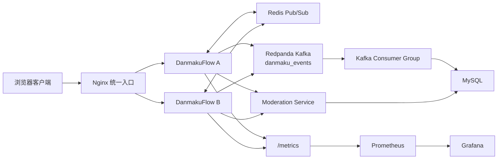
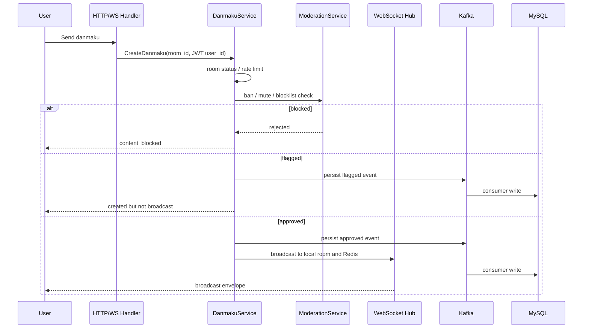
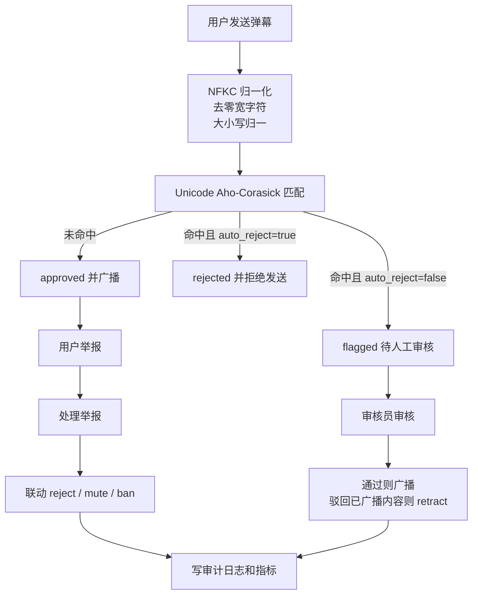

# DanmakuFlow

面向直播互动场景的实时弹幕系统。项目不是只做一个 WebSocket demo，而是把“用户进入直播间、发送弹幕、跨实例广播、异步落库、内容审核、用户举报、人工处置、审计与监控”串成一条可运行的业务闭环。

这个 README 按后端校招面试的阅读习惯组织：先看业务问题和架构，再看关键链路、可靠性取舍、可观测性和可验证命令。


## 项目亮点

| 方向 | 实现 | 面试可展开的问题 |
| --- | --- | --- |
| 实时链路 | WebSocket 房间广播，Nginx 双实例入口，Redis Pub/Sub 跨实例转发 | 单机 Hub 如何扩展到多实例，慢连接如何处理 |
| 持久化链路 | Kafka 事件流，consumer 幂等写 MySQL；未启用 Kafka 时退化为本地异步写 | 为什么实时广播和落库解耦，at-least-once 如何落地 |
| 直播间业务 | JWT 身份、匿名观看、登录发送、房主开播/关播、房间状态机 | 业务状态如何约束写入和 WebSocket 准入 |
| 弹幕治理 | 屏蔽词、NFKC 归一化、零宽字符处理、Unicode Aho-Corasick、举报与人工审核 | 如何从“关键词过滤”升级为治理闭环 |
| 权限与审计 | user/moderator/admin 角色，禁言/封禁/角色变更，审计日志 | 管理操作如何避免越权和不可追溯 |
| 工程验证 | 单测、race 测试、集成脚本、Prometheus/Grafana、pprof 开关 | 如何证明系统不是只能本机跑通 |

## 业务模型

DanmakuFlow 把直播互动拆成三个核心对象：

- `User`: 普通用户、审核员、管理员。用户可以匿名观看，登录后才能发送弹幕和举报。
- `Room`: 直播间有 `pending -> live -> ended` 状态机，只有 `live` 状态允许发送弹幕。
- `Danmaku`: 弹幕有 `approved / flagged / rejected / pending` 审核状态，历史列表只返回已通过内容。

核心业务路径：

1. 主播创建直播间，开始直播。
2. 观众通过 WebSocket 加入房间，匿名用户只能观看。
3. 登录用户发送弹幕，服务端从 JWT 取 `user_id`，忽略客户端伪造身份。
4. 弹幕先经过房间状态、频控、封禁、禁言、屏蔽词检查。
5. 正常弹幕广播给房间所有客户端，同时进入 Kafka/MySQL 持久化链路。
6. 可疑弹幕进入 `flagged`，等待审核员通过或驳回。
7. 用户可举报弹幕，审核员处理举报并联动驳回、禁言、封禁。

## 架构



设计上的核心拆分：

- WebSocket Hub 负责房间连接、心跳、慢客户端踢出、本地广播。
- Redis Pub/Sub 只负责跨实例实时转发，不承担历史补偿。
- Kafka 负责弹幕事件持久化，consumer 写 MySQL，写入通过弹幕 ID 做幂等。
- MySQL 保存用户、房间、弹幕、举报、禁言、审计日志等业务状态。
- Moderation Service 进入发送链路和后台管理链路，避免治理能力只停留在接口层。

## 弹幕发送链路



这条链路体现几个后端关注点：

- 身份只信服务端解析的 JWT，不信请求体中的 `user_id`。
- 房间不是简单字符串分组，而是有状态机约束。
- 实时广播和持久化解耦，Kafka 故障会返回明确错误，不做“假成功”。
- 命中屏蔽词时，根据配置 `auto_reject` 决定直接拒绝或进入待审。
- 历史列表按 `room_id + status + created_at` 查询，只暴露 `approved` 弹幕。

## 审核与治理闭环

治理链路覆盖“预防、发现、处置、追溯”四个环节。



治理能力不是简单的“敏感词 if 判断”：

- 屏蔽词加载后统一预处理，避免大小写、全角字符、零宽字符绕过。
- Aho-Corasick 自动机使用 `map[rune]`，支持中文和 Unicode 文本。
- 举报接口校验弹幕存在、房间归属、举报人身份、重复举报和封禁用户。
- 举报处理支持 `confirmed / dismissed`，并可联动 `reject / mute / ban`。
- 审核状态转换有约束，重复处理保持幂等。
- `approved -> rejected` 会给房间广播 `retract` 消息，客户端可撤回已展示内容。
- 管理操作写入 `audit_logs`，并暴露 `danmakuflow_moderation_*` 指标。

## 可靠性语义

| 模块 | 当前语义 | 取舍 |
| --- | --- | --- |
| WebSocket 本地广播 | 房间内有界队列，慢客户端发送失败会被断开 | 保护服务端，不让单个慢连接拖垮房间 |
| Redis Pub/Sub | at-most-once，断线期间消息不会补发 | 用于实时扩散，不作为可靠消息队列 |
| Kafka produce | 同步发送，`acks=all`，有限重试 | 成功后再认为进入持久化链路，延迟高于纯内存队列 |
| Kafka consume | consumer group 手动提交 offset，MySQL 通过弹幕 ID 幂等 | 支持 at-least-once，重复消息不会重复入库 |
| MySQL 异步写 | 未启用 Kafka 时使用本地 channel 写入 | 简化本地运行，但进程崩溃时可能丢失 channel 内消息 |
| Readyz | MySQL 是 required，Redis/Kafka 是 degraded | 区分核心存储不可用和实时扩展能力降级 |
| 优雅关闭 | HTTP 停止接入，等待 in-flight 和写队列，再关 Hub/依赖 | 降低关停期间的数据丢失和广播竞态 |

这些边界是有意写在 README 里的。面试时比“保证不丢消息”更重要的是说明每个组件负责什么、失败时系统退化成什么状态。

## 权限模型

| 角色 | 能力 |
| --- | --- |
| 匿名用户 | 观看直播间、接收实时弹幕 |
| user | 登录发送弹幕、举报弹幕 |
| moderator | 查看举报、审核弹幕、处理举报、房间内禁言/解禁、查看审计日志 |
| admin | moderator 全部能力，外加封禁/解封用户、修改角色 |

额外保护：

- admin 不能封禁另一个 admin。
- admin 不能修改自己的角色。
- 系统不能降级最后一个 admin。
- 权限校验在 service 层也执行，不只依赖 HTTP middleware。

## 技术栈

| 层 | 技术 |
| --- | --- |
| 语言 | Go 1.26.4 |
| HTTP | Gin |
| WebSocket | gorilla/websocket |
| 存储 | MySQL 8.0, GORM, MemoryStore |
| 跨实例广播 | Redis Pub/Sub |
| 事件流 | Redpanda Kafka, IBM/sarama |
| 认证 | JWT, bcrypt |
| 监控 | Prometheus, Grafana |
| 部署 | Docker Compose, Nginx |

## 快速开始

单实例本地运行：

```bash
git clone https://github.com/1012-Penn/DanmakuFlow.git
cd DanmakuFlow
go mod tidy
go run .
```

访问 `http://localhost:8080`，注册或登录后创建直播间。

双实例演示环境：

```bash
docker compose up --build -d
go run scripts/demo_setup.go
```

服务地址：

| 服务 | 地址 |
| --- | --- |
| Nginx 入口 | http://localhost:8080 |
| App A | http://localhost:8081 |
| App B | http://localhost:8082 |
| MySQL | localhost:3307 |
| Redis | localhost:6380 |
| Kafka | localhost:9092 |
| Prometheus | http://localhost:9090 |
| Grafana | http://localhost:3000 |

运行集成验证：

```bash
bash scripts/integration-test.sh
```

## 常用配置

配置文件是 `config.yaml`，也支持环境变量覆盖。

| 配置 | 说明 |
| --- | --- |
| `SERVER_PORT` | HTTP 监听端口 |
| `STORE_DSN` | MySQL DSN，空值时使用 MemoryStore |
| `REDIS_ADDR` | Redis 地址，空值时关闭跨实例广播 |
| `KAFKA_BROKERS` | Kafka broker 列表，逗号分隔 |
| `JWT_SECRET` | JWT 签名密钥，部署时必须显式设置 |
| `MODERATION_AUTO_REJECT` | 命中屏蔽词后是否直接拒绝 |
| `MODERATION_FAIL_CLOSED` | 审核异常时是否拒绝发送 |
| `MODERATION_BLOCKLIST_PATH` | 屏蔽词文件路径 |
| `PPROF_ENABLED` | 是否开启 `/debug/pprof` |

本地调试示例：

```bash
SERVER_PORT=9090 LOG_LEVEL=debug LOG_FORMAT=text go run .
```

## HTTP 与 WebSocket 接口

| 方法 | 路径 | 说明 |
| --- | --- | --- |
| `POST` | `/api/auth/register` | 注册 |
| `POST` | `/api/auth/login` | 登录并返回 JWT |
| `GET` | `/api/auth/me` | 查询当前用户 |
| `POST` | `/api/rooms` | 创建直播间 |
| `GET` | `/api/rooms?status=live&limit=20` | 查询直播间列表 |
| `GET` | `/api/rooms/:id` | 查询直播间 |
| `POST` | `/api/rooms/:id/start` | 房主开播 |
| `POST` | `/api/rooms/:id/end` | 房主关播 |
| `POST` | `/api/room/:room_id/danmaku` | 发送弹幕 |
| `GET` | `/api/room/:room_id/danmaku` | 查询历史弹幕 |
| `POST` | `/api/room/:room_id/report` | 举报弹幕 |
| `GET` | `/ws?room_id=...&token=...` | WebSocket 实时通道 |
| `GET` | `/healthz` | 进程存活 |
| `GET` | `/readyz` | 依赖就绪状态 |
| `GET` | `/metrics` | Prometheus 指标 |

管理接口需要 JWT 和对应角色：

| 方法 | 路径 | 角色 | 说明 |
| --- | --- | --- | --- |
| `GET` | `/api/admin/reports` | moderator/admin | 查看举报 |
| `POST` | `/api/admin/reports/:id/resolve` | moderator/admin | 处理举报 |
| `POST` | `/api/admin/danmaku/:id/review` | moderator/admin | 审核弹幕 |
| `GET` | `/api/admin/flagged-danmaku` | moderator/admin | 查看待审弹幕 |
| `POST` | `/api/admin/rooms/:room_id/mute` | moderator/admin | 房间内禁言 |
| `POST` | `/api/admin/rooms/:room_id/unmute` | moderator/admin | 解除禁言 |
| `GET` | `/api/admin/audit-log` | moderator/admin | 查看审计日志 |
| `POST` | `/api/admin/users/:id/ban` | admin | 封禁用户 |
| `POST` | `/api/admin/users/:id/unban` | admin | 解封用户 |
| `POST` | `/api/admin/users/:id/role` | admin | 修改角色 |

WebSocket 消息使用统一信封：

```json
{
  "type": "broadcast",
  "payload": {
    "id": "danmaku-id",
    "room_id": "room-id",
    "content": "hello"
  }
}
```

当前消息类型包括 `broadcast`、`ack`、`error`、`history`、`retract`。

## 可观测性

Prometheus 指标以 `danmakuflow_` 为前缀，覆盖：

- WebSocket 连接数、活跃房间、拒绝原因、慢客户端踢出、投递量。
- Redis publish 成功/失败/丢弃、发布延迟、订阅状态。
- 持久化队列长度、写入成功/失败/丢弃、写入延迟。
- Kafka produce/consume 数量和错误分类。
- HTTP 请求量和延迟。
- 审核动作数量、待审队列大小。

Grafana 面板位于 `grafana/dashboards/danmakuflow-overview.json`。

## 测试与压测

常用验证命令：

```bash
go test ./...
go test -race ./...
bash scripts/integration-test.sh
```

压测入口：

```bash
go run ./cmd/benchmark \
  -addr localhost:8080 \
  -room benchmark \
  -c 100 \
  -r 200ms \
  -talker-ratio 0.2 \
  -d 10s
```

仓库中保留了本地压测记录 `benchmark_results.log`。例如在本地双实例环境下，100 个连接、10 秒稳态、20% 发送者的记录达到约 99k 次客户端投递且无丢失；1000 个连接、10 秒稳态、5% 发送者的记录达到约 487k 次客户端投递，约 48.7k/s，且无丢失。压测结果依赖机器配置、Docker 资源和参数，README 不把它包装成线上容量承诺。

## 目录结构

```text
.
├── cmd/benchmark              # WebSocket 压测客户端
├── config                     # YAML 与环境变量配置
├── handler                    # HTTP 路由、认证中间件、管理接口
├── metrics                    # Prometheus 指标定义
├── model                      # 用户、房间、弹幕、举报、审计、禁言模型
├── redisclient                # Redis Pub/Sub 客户端
├── service                    # 弹幕、房间、认证、Kafka、审核治理业务逻辑
├── store                      # MemoryStore 与 MySQL/GORM 实现
├── websocket                  # Hub、Room、Client、WebSocket 准入与广播
├── templates                  # 原生 HTML/JS 前端页面
├── scripts                    # 演示数据和集成测试脚本
├── prometheus                 # Prometheus 配置
├── grafana                    # Grafana 数据源与面板
├── docker-compose.yml         # 双实例本地环境
└── nginx.conf                 # WebSocket 反向代理和负载均衡
```

## 当前边界与后续方向

当前项目仍然是本科生后端项目，不假装具备完整线上生产能力。比较适合继续扩展的方向：

1. 治理策略版本化：屏蔽词、处置原因、审核规则可以做成可发布、可回滚的策略集。
2. 消息可靠性增强：Redis Pub/Sub 可以替换或补充为 Redis Stream、Kafka fanout 或专门的消息投递层。
3. 管理后台完善：当前治理能力主要是 API，后续可以补审核台、举报队列和操作审计检索。
4. 压测方法固化：补充固定机器配置、脚本参数、Grafana 截图和 pprof 分析，让性能结论更可复现。

这个项目的重点不是堆组件，而是展示对后端业务系统的完整思考：实时性、持久化、权限、治理、可观测性、失败语义和验证手段都在同一个可运行系统里闭合。
